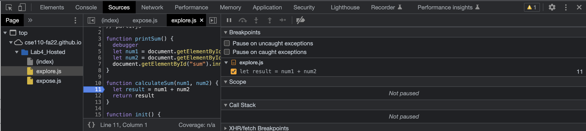
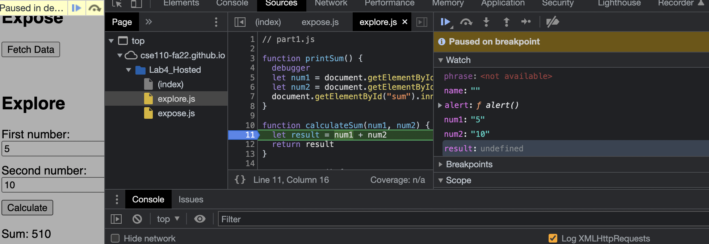
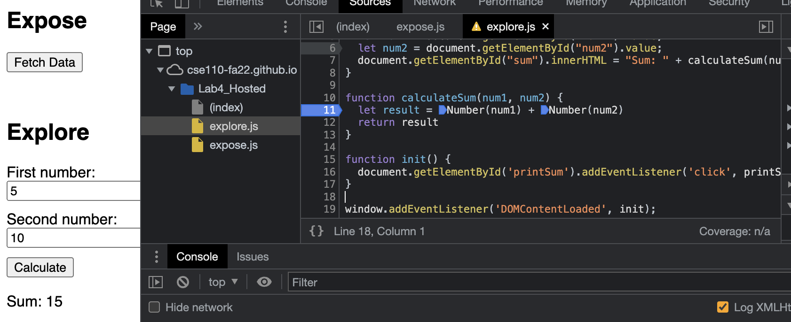

Breakpoint set 
Watch expressions 
Fix 
1. The bug was that the type being inputed were strings and thus the func was concatenating the input.
2. My fix was type casting the input parameters to integers and adding them.